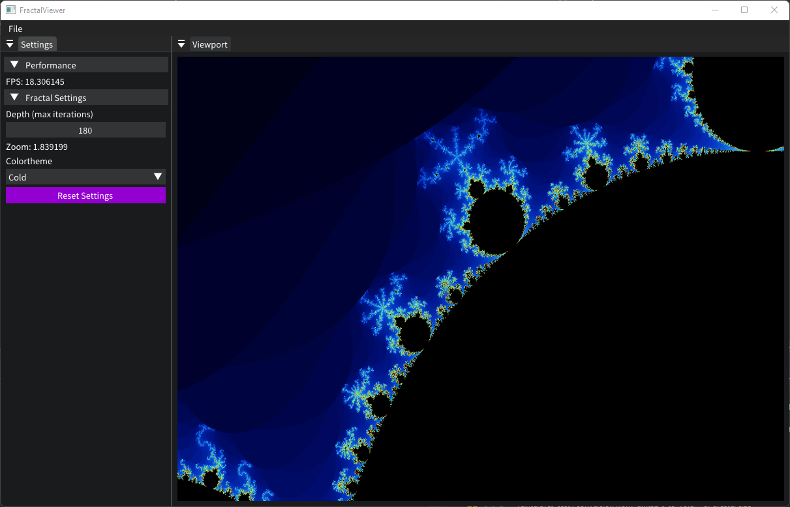
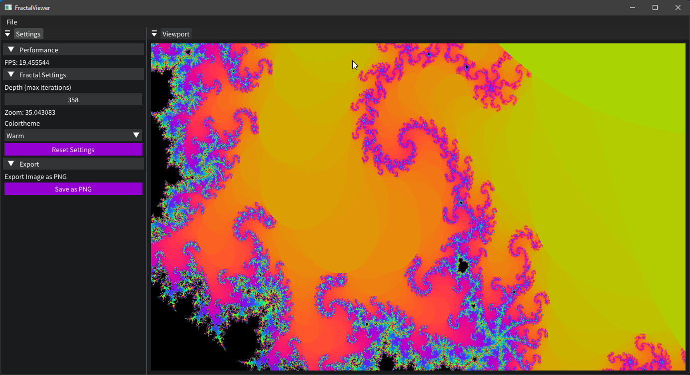

# FractalViewer - Fractal Rendering

 
 

GPU accelerated double-precision fractal rendering

## Controls

 - Scroll in order to zoom in or out
 - Change depth (max iterations) via the settings panel
 - Move around with WASD or arrow keys

## Build

You need to have Visual Studio 2019 or later installed in order to build the program.

Select x64 and Release mode for optimal performance

## Example Images

You can choose between a warm and a cold theme

### Cold colortheme

### Warm colortheme
